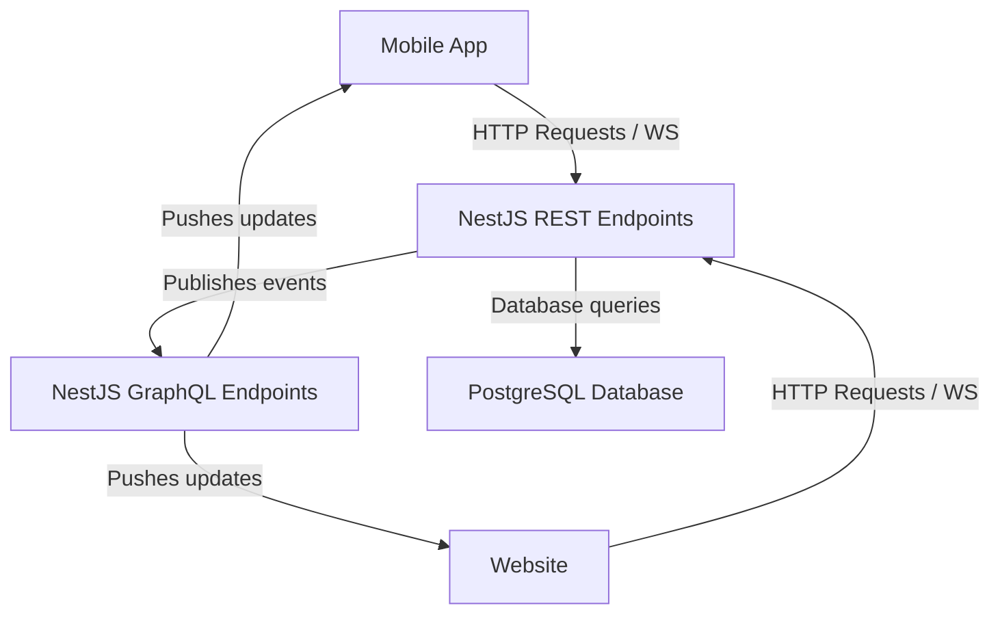

## Description

### Diagram



### Demo


- OpenAPI Swagger UI: <http://localhost:3000/api>
- GraphQL Playground UI: <http://localhost:3000/graphql>

GraphQL subscription endpoint: <ws://localhost:3000/graphql>

REST and GRAPHQL requests must be authenticated with a JWT token. Format for
Authentication: 'Bearer <YOUR_JWT_OR_API_KEY>'

#### Setting the auth token for the GraphQL explorer

Click the Settings Gear in the top-right. In the Settings panel, look for HTTP
Headers or Headers (the UI may say “Add header” or show a JSON editor). Provide
a JSON object that includes your header(s).

"Authorization": "Bearer YOUR_JWT_TOKEN"

## Steps I took setting up the project

```bash
node --version # v20.18.2
npm --version # v10.8.2
alias nest='npx @nestjs/cli@11.0.2'
nest --version # 11.0.2

nest new canvassing
npm i
npm install typeorm --save
npm install reflect-metadata --save
npm install @types/node --save-dev
npm install pg --save
npm install --save @nestjs/typeorm typeorm pg
npm install -g @mermaid-js/mermaid-cli
npm install --save @nestjs/swagger
npm i @nestjs/graphql @nestjs/apollo @apollo/server graphql --save
npm install --save @nestjs/passport passport passport-local bcrypt
npm install --save-dev @types/passport-local
npm install --save @nestjs/jwt passport-jwt
npm install --save-dev @types/passport-jwt
```

## Development Environment

### PostgreSQL locally for development

[Docker compose](https://docs.docker.com/compose/) is utilized for local development to provide a development PostgreSQL database. The <./docker-compose.yml> file sets the database and user name, and password default. You can override the password by setting the `POSTGRES_PASSWORD` environment variable.

```bash

# Start PostgreSQL locally, in the background.
$ docker-compose up -d
```

### Loading demo data

TODO: Describe steps to prepare and load demonstration data to the PostgreSQL db.


## Nest.js - Compile and run commands

```bash
# development
$ npm run start

# watch mode
$ npm run start:dev

# production mode
$ npm run start:prod
```

## Nest.js - Run tests

```bash
# unit tests
$ npm run test

# e2e tests
$ npm run test:e2e

# test coverage
$ npm run test:cov
```

## Nest.js -- Deployment

When you're ready to deploy your NestJS application to production, there are some key steps you can take to ensure it runs as efficiently as possible. Check out the [deployment documentation](https://docs.nestjs.com/deployment) for more information.

If you are looking for a cloud-based platform to deploy your NestJS application, check out [Mau](https://mau.nestjs.com), our official platform for deploying NestJS applications on AWS. Mau makes deployment straightforward and fast, requiring just a few simple steps:

```bash
$ npm install -g mau
$ mau deploy
```

With Mau, you can deploy your application in just a few clicks, allowing you to focus on building features rather than managing infrastructure.

## Nest.js -- Resources

Check out a few resources that may come in handy when working with NestJS:

- Visit the [NestJS Documentation](https://docs.nestjs.com) to learn more about the framework.
- For questions and support, please visit our [Discord channel](https://discord.gg/G7Qnnhy).
- To dive deeper and get more hands-on experience, check out our official video [courses](https://courses.nestjs.com/).
- Deploy your application to AWS with the help of [NestJS Mau](https://mau.nestjs.com) in just a few clicks.
- Visualize your application graph and interact with the NestJS application in real-time using [NestJS Devtools](https://devtools.nestjs.com).
- Need help with your project (part-time to full-time)? Check out our official [enterprise support](https://enterprise.nestjs.com).
- To stay in the loop and get updates, follow us on [X](https://x.com/nestframework) and [LinkedIn](https://linkedin.com/company/nestjs).
- Looking for a job, or have a job to offer? Check out our official [Jobs board](https://jobs.nestjs.com).

